<p align="center">
  
</p>

<h1 align="center">乔格 QiaoGrid</h1>

<p align="center">
  <strong>从图片转换到分板跟做，把完整拼豆流程装进一台 Android 设备。</strong>
</p>

<p align="center">
  <a href="https://github.com/xiaoxuesheng123467/QiaoGrid/actions/workflows/android.yml"></a>
  <a href="https://github.com/xiaoxuesheng123467/QiaoGrid/releases/latest"></a>
  
  
  <a href="https://github.com/xiaoxuesheng123467/QiaoGrid/stargazers"></a>
</p>

<p align="center">
  <a href="https://github.com/xiaoxuesheng123467/QiaoGrid/releases/latest"><strong>下载 APK</strong></a>
  ·
  <a href="https://shuogewudi.pages.dev/qiaogrid-app"><strong>查看产品页</strong></a>
  ·
  <a href="https://github.com/xiaoxuesheng123467/QiaoGrid"><strong>⭐ 喜欢就点个 Star</strong></a>
</p>

乔格是一款面向实际手工流程的 Android 拼豆工具。它不只做图片像素化，而是把图纸生成、手动修图、分板跟做、库存核对和导出放在同一个离线工作流里。

## 下载

- [GitHub Releases](https://github.com/xiaoxuesheng123467/QiaoGrid/releases/latest)
- [产品详情与 APK 下载](https://shuogewudi.pages.dev/qiaogrid-app)

当前版本为 `2.0.2`，支持 Android 8.0 及以上。`2.0.2` 将产品品牌从“豆格 DouGrid”更名为“乔格 QiaoGrid”，Android 包名和 `.dougrid` 项目格式保持不变，因此已安装 2.x 的用户可以直接升级，原有项目也可继续使用。由于 2.0.0 以前的旧版签名密钥已经无法找回，1.x 仍不能直接覆盖安装 2.x；请先导出项目、卸载旧版，再安装新包。App 不申请网络权限，图片识别、备份和数据交换全程离线完成，项目、参考图和库存数据只保存在设备本机。

## 界面

<p align="center">
  
  
  
</p>

## 已实现

- 21 款原创预设，分为花植、食物、动物、风景、节日、几何和实用 7 类
- 照片与像素图两种转换模式，支持 JPG、PNG、WebP、GIF、BMP、HEIC/HEIF，以及系统可解码的 AVIF
- 可移动、缩放或重新框选裁剪区域，先排除照片背景，再从原图生成最终图纸和对齐参考图
- 识图时自动匹配品牌豆子型号并统计颗数，支持优先使用库存或严格限制每个色号的可用数量
- OKLab 感知颜色匹配、受控减色、可调抖动、杂点清理与边缘保留
- MARD 221/291、COCO 291 和 Artkal C197 品牌色卡
- 画笔和橡皮实时落豆，支持填充、吸色、同色替换、区域复制/移动/旋转/镜像、整笔撤销/重做和参考图临摹
- 支持 8–64 的自定义实体板尺寸，提供多板进度、下一未完成板、批量完成、按色高亮、隐藏已拼和累计计时
- 豆仓库存、低库存提醒、项目缺料、智能替色预览、包装数量、采购单、到货入库和 CSV 批量导入导出
- 支持横版/竖版、5 mm 实物 1:1 比例和校准标记的矢量 PDF，以及有尺寸上限的像素/网格 PNG 导出
- 项目搜索、排序、状态/收藏/文件夹筛选、标签、副本、回收站、自动保存和异常恢复
- 版本化 `.dougrid` 项目包，可离线迁移图纸、色卡快照、参考图和制作进度
- 首次启动分步教程，作品页右上角可随时重新打开
- 数据与原图只保存在本机，不需要账号和网络

## 技术结构

- Kotlin + Jetpack Compose + Material 3
- `:core` 保持纯 Kotlin，负责网格、历史和量化算法
- `:app` 负责 Android 图像解码、Compose UI、持久化和导出
- `IntArray` 网格与差分撤销，避免大图纸产生大量对象
- `AtomicFile` 落盘，保留可恢复的项目状态

## 构建

需要 JDK 17 以上和 Android SDK 36。

```bash
./gradlew :core:test :app:assembleDebug :app:lintDebug
```

Debug APK 位于 `app/build/outputs/apk/debug/app-debug.apk`。

本地正式包需要一个未提交的 `keystore.properties` 和对应 keystore。签名材料不在本公开仓库中；不要将 keystore、密码或 `keystore.properties` 提交到这里。

## 产品参考

功能取舍基于成熟拼豆工具的公开产品页，没有复制它们的代码、图纸或视觉素材。

- [Perlypop](https://perlypop.com/)：图片转换、完整编辑、分板辅助与制作进度
- [BeadStudio](https://play.google.com/store/apps/details?id=com.datscharf.beadstudiofree)：品牌色卡、自定义可用色、取景和图像调整
- [Pixel-Beads](https://www.pixel-beads.net/)：颜色数限制、品牌匹配和可打印 PDF
- [Beadify](https://beadify.app/)：库存限制转换、豆数统计和实体板打印导向

## 喜欢乔格？

如果乔格让你的拼豆流程更轻松，欢迎点一下仓库右上角的 [⭐ Star](https://github.com/xiaoxuesheng123467/QiaoGrid)。你的支持会让我继续改进图片转换、图纸编辑和分板跟做体验。

## 色卡数据

色卡参考数据来自 MIT 许可的 `HansBug/pindou-color-data`，固定在 revision `178dafbc9e77d3de556550dbd058270200129186`。完整归属、上游文件和实物色差说明见 [THIRD_PARTY_NOTICES.md](THIRD_PARTY_NOTICES.md)。

## 许可

除 `THIRD_PARTY_NOTICES.md` 明确列出的第三方材料外，本项目暂未授予开源许可。公开源代码用于查看与交流，不代表允许复制、分发或制作衍生版本。
