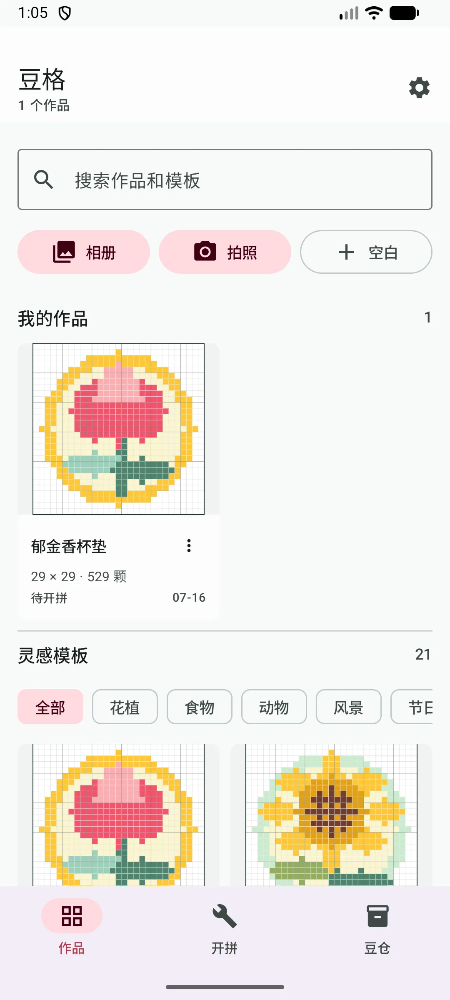
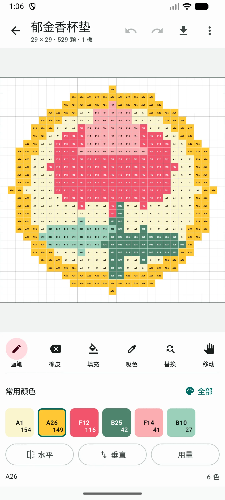
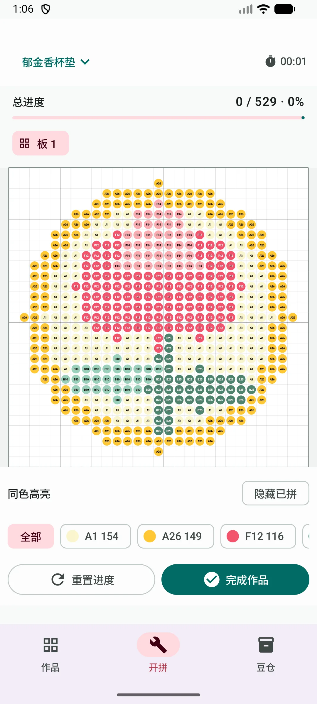

# 豆格

[](https://github.com/xiaoxuesheng123467/DouGrid/actions/workflows/android.yml)

豆格是一款面向实际手工流程的 Android 拼豆工具。它不只做图片像素化，而是把图纸生成、手动修图、分板跟做、库存核对和导出放在同一个离线工作流里。

## 下载

- [GitHub Releases](https://github.com/xiaoxuesheng123467/DouGrid/releases/latest)
- [产品详情与 APK 下载](https://shuogewudi.pages.dev/dougrid-app)

当前版本为 `1.0.0`，支持 Android 8.0 及以上。App 不申请网络权限，项目、原图和库存数据只保存在设备本机。

## 界面

<p align="center">
  
  
  
</p>

## 已实现

- 21 款原创预设，分为花植、食物、动物、风景、节日、几何和实用 7 类
- 照片与像素图两种转换模式，支持真实图纸预览、原图对照和取景调整
- OKLab 感知颜色匹配、受控减色、可调抖动、杂点清理与边缘保留
- MARD 221/291、COCO 291 和 Artkal C197 品牌色卡
- 画笔、橡皮、填充、吸色、同色替换、镜像、撤销/重做和参考图临摹
- 按 29 × 29 实体板拆分，逐颗完成、按色高亮、隐藏已拼和计时
- 豆仓库存、项目缺料、包装数量与采购单
- 矢量 PDF 和有尺寸上限的 PNG 导出
- 项目搜索、收藏、副本、回收站、自动保存和异常恢复
- 数据与原图只保存在本机，不需要账号和网络

## 技术结构

- Kotlin + Jetpack Compose + Material 3
- `:core` 保持纯 Kotlin，负责网格、历史和量化算法
- `:app` 负责 Android 图像解码、Compose UI、持久化和导出
- `IntArray` 网格与差分撤销，避免大图纸产生大量对象
- `AtomicFile` 落盘，保留可恢复的项目状态

## 构建

需要 JDK 17 以上和 Android SDK 36。

```bash
./gradlew :core:test :app:assembleDebug :app:lintDebug
```

Debug APK 位于 `app/build/outputs/apk/debug/app-debug.apk`。

## 产品参考

功能取舍基于成熟拼豆工具的公开产品页，没有复制它们的代码、图纸或视觉素材。

- [Perlypop](https://perlypop.com/)：图片转换、完整编辑、分板辅助与制作进度
- [BeadStudio](https://play.google.com/store/apps/details?id=com.datscharf.beadstudiofree)：品牌色卡、自定义可用色、取景和图像调整
- [Pixel-Beads](https://www.pixel-beads.net/)：颜色数限制、品牌匹配和可打印 PDF
- [Beadify](https://beadify.app/)：库存限制转换、豆数统计和实体板打印导向

## 色卡数据

色卡参考数据来自 MIT 许可的 `HansBug/pindou-color-data`，固定在 revision `178dafbc9e77d3de556550dbd058270200129186`。完整归属、上游文件和实物色差说明见 [THIRD_PARTY_NOTICES.md](THIRD_PARTY_NOTICES.md)。

## 许可

除 `THIRD_PARTY_NOTICES.md` 明确列出的第三方材料外，本项目暂未授予开源许可。公开源代码用于查看与交流，不代表允许复制、分发或制作衍生版本。
